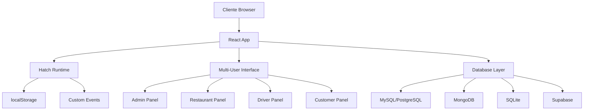
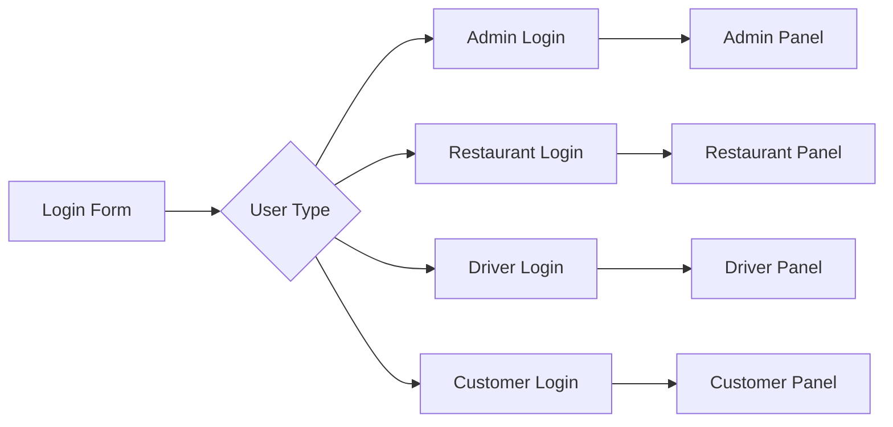

# Documento de Design - Sistema de Delivery Completo

## Visão Geral

O Sistema de Delivery Completo será construído como uma aplicação React single-page que integra múltiplos painéis de usuário em uma única interface. O sistema utilizará o runtime Hatch com hooks personalizados para persistência de estado e sincronização em tempo real entre diferentes componentes.

## Arquitetura

### Arquitetura Geral


### Padrão de Componentes
- **Single Component Architecture**: Todo o sistema será implementado em um único componente React exportado
- **State Management**: Uso do hook `useStoredState` do Hatch para persistência automática
- **Event-Driven Sync**: Eventos customizados para sincronização entre painéis
- **Conditional Rendering**: Renderização condicional baseada no tipo de usuário logado

## Componentes e Interfaces

### 1. Componente Principal (SistemaDeliveryCompleto)

**Responsabilidades:**
- Gerenciar estado global da aplicação
- Controlar autenticação e autorização
- Renderizar interface apropriada baseada no usuário
- Sincronizar dados entre painéis

**Estados Principais:**
```javascript
// Autenticação e usuários
const [isAuthenticated, setIsAuthenticated] = useState(false)
const [currentUser, setCurrentUser] = useStoredState('current_user', null)
const [userType, setUserType] = useStoredState('user_type', null) // admin, restaurant, driver, customer

// Dados do sistema
const [restaurants, setRestaurants] = useStoredState('restaurants', [])
const [drivers, setDrivers] = useStoredState('drivers', [])
const [customers, setCustomers] = useStoredState('customers', [])
const [products, setProducts] = useStoredState('products', [])
const [orders, setOrders] = useStoredState('orders', [])
const [reviews, setReviews] = useStoredState('reviews', [])

// Configuração
const [databaseConfig, setDatabaseConfig] = useStoredState('database_config', {})
```

### 2. Sistema de Autenticação

**Interface de Login:**
- Login unificado com seleção de tipo de usuário
- Validação de credenciais por tipo
- Redirecionamento automático para painel apropriado
- Persistência de sessão via localStorage

**Fluxo de Autenticação:**


### 3. Painel Administrativo

**Funcionalidades:**
- Aprovação de restaurantes e entregadores
- Gerenciamento de usuários
- Configuração de banco de dados
- Relatórios e estatísticas
- Monitoramento do sistema

**Componentes:**
- `AdminDashboard`: Visão geral do sistema
- `UserManagement`: Aprovação e gerenciamento de usuários
- `DatabaseConfig`: Configuração de conexão com banco
- `SystemReports`: Relatórios e métricas

### 4. Painel do Restaurante

**Funcionalidades:**
- Gerenciamento de cardápio (CRUD produtos)
- Recebimento e processamento de pedidos
- Controle de status de pedidos
- Histórico de vendas
- Configurações do restaurante

**Componentes:**
- `RestaurantDashboard`: Visão geral de pedidos
- `MenuManagement`: Gerenciamento de produtos
- `OrderProcessing`: Processamento de pedidos
- `RestaurantSettings`: Configurações

### 5. Painel do Entregador

**Funcionalidades:**
- Visualização de pedidos disponíveis
- Aceitação de entregas
- Atualização de status de entrega
- Histórico de entregas
- Perfil do entregador

**Componentes:**
- `DriverDashboard`: Pedidos disponíveis
- `DeliveryTracking`: Rastreamento de entregas
- `DeliveryHistory`: Histórico
- `DriverProfile`: Perfil

### 6. Painel do Cliente

**Funcionalidades:**
- Navegação por restaurantes
- Visualização de cardápios
- Carrinho de compras
- Finalização de pedidos
- Acompanhamento de pedidos
- Sistema de avaliações

**Componentes:**
- `CustomerMarketplace`: Marketplace de restaurantes
- `RestaurantMenu`: Cardápio do restaurante
- `ShoppingCart`: Carrinho de compras
- `OrderTracking`: Acompanhamento de pedidos
- `ReviewSystem`: Sistema de avaliações

## Modelos de Dados

### 1. Usuário Base
```javascript
{
  id: string,
  name: string,
  email: string,
  password: string,
  phone: string,
  address: string,
  neighborhood: string,
  status: 'pending' | 'approved' | 'rejected' | 'suspended',
  createdAt: string,
  updatedAt: string
}
```

### 2. Restaurante
```javascript
{
  ...UserBase,
  cnpj: string,
  category: string,
  description: string,
  manager: string,
  deliveryFee: number,
  deliveryTime: string,
  workingHours: string,
  rating: number,
  totalOrders: number,
  totalReviews: number
}
```

### 3. Entregador
```javascript
{
  ...UserBase,
  cpf: string,
  vehicle: string,
  licensePlate: string,
  driverLicense: string,
  isAvailable: boolean,
  currentDeliveries: string[],
  rating: number,
  totalDeliveries: number
}
```

### 4. Cliente
```javascript
{
  ...UserBase,
  cpf: string,
  referencePoint: string,
  orderHistory: string[],
  favoriteRestaurants: string[]
}
```

### 5. Produto
```javascript
{
  id: string,
  restaurantId: string,
  name: string,
  description: string,
  price: number,
  category: string,
  image: string,
  ingredients: string,
  preparationTime: number,
  isAvailable: boolean,
  createdAt: string,
  updatedAt: string
}
```

### 6. Pedido
```javascript
{
  id: string,
  customerId: string,
  customerName: string,
  items: OrderItem[],
  restaurants: RestaurantOrder[],
  total: number,
  status: 'pending' | 'accepted' | 'preparing' | 'ready' | 'out_for_delivery' | 'delivered' | 'cancelled',
  deliveryAddress: string,
  phone: string,
  paymentMethod: string,
  deliveryType: 'restaurant' | 'system',
  driverId?: string,
  driverName?: string,
  notes: string,
  createdAt: string,
  acceptedAt?: string,
  readyAt?: string,
  deliveredAt?: string,
  updatedAt: string
}
```

### 7. Avaliação
```javascript
{
  id: string,
  orderId: string,
  customerId: string,
  restaurantId: string,
  driverId?: string,
  restaurantRating: number,
  driverRating?: number,
  restaurantComment: string,
  driverComment?: string,
  generalComment: string,
  createdAt: string
}
```

## Tratamento de Erros

### 1. Validação de Dados
- Validação client-side para todos os formulários
- Mensagens de erro específicas e claras
- Prevenção de submissão de dados inválidos

### 2. Tratamento de Estados de Erro
- Estados de loading para operações assíncronas
- Fallbacks para falhas de conexão
- Retry automático para operações críticas

### 3. Sincronização de Dados
- Detecção de conflitos de dados
- Resolução automática quando possível
- Notificação ao usuário em casos de conflito

## Estratégia de Testes

### 1. Testes Unitários
- Testes para funções de validação
- Testes para lógica de negócio
- Testes para utilitários de formatação

### 2. Testes de Integração
- Testes de fluxo de pedidos
- Testes de sincronização entre painéis
- Testes de persistência de dados

### 3. Testes de Interface
- Testes de navegação entre painéis
- Testes de formulários
- Testes de responsividade

### 4. Testes de Performance
- Testes de carregamento com grandes volumes de dados
- Testes de sincronização em tempo real
- Testes de memória e vazamentos

## Configuração de Banco de Dados

### 1. Suporte Multi-Database
O sistema suportará múltiplos tipos de banco de dados:

**MySQL/PostgreSQL:**
```javascript
{
  type: 'mysql' | 'postgresql',
  host: string,
  port: number,
  database: string,
  username: string,
  password: string,
  ssl: boolean
}
```

**MongoDB:**
```javascript
{
  type: 'mongodb',
  connectionString: string,
  database: string
}
```

**SQLite:**
```javascript
{
  type: 'sqlite',
  filePath: string
}
```

**Supabase:**
```javascript
{
  type: 'supabase',
  url: string,
  publicKey: string,
  serviceKey?: string
}
```

### 2. Migração de Dados
- Sistema de migração do localStorage para banco de dados
- Validação de integridade dos dados
- Backup automático antes da migração

## Sincronização e Performance

### 1. Event-Driven Architecture
- Eventos customizados para sincronização entre componentes
- Debouncing para evitar atualizações excessivas
- Batching de atualizações para melhor performance

### 2. Otimizações
- Lazy loading de componentes não críticos
- Memoização de cálculos pesados
- Virtualização para listas grandes
- Compressão de dados no localStorage

### 3. Real-time Updates
- Polling para atualizações de pedidos
- WebSocket support para notificações em tempo real
- Sincronização automática entre abas do navegador